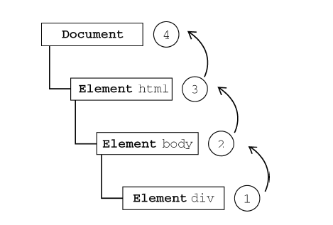
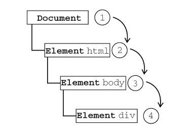
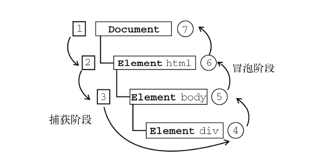

# 浏览器事件机制

#### Question

- 为什么要有事件机制？
- 重排和重绘（回流）
- 为什么CSS比JS DOM操作成本低 ？
- 防抖和节流

#### 事件

- 就是文档或浏览器窗口中发生的一些特定的交互瞬间。

- 可以使用侦听器（或处理程序）来预订事件，以便事件发生时执行相应的代码。这种在传统软件工程中被称为`观察员模式`的模型


####  事件流

- `IE`与`Netscape`之争
 


- 可以想象画在一张纸上的一组同心圆。如果你把手指放在圆心上，那么你的手指指向的不是一个圆，而是纸上的所有圆。

- 描述的是从页面中接收事件的顺序。`代码结构上的嵌套`

- 冒泡 (IE) 

  - 所有现代浏览器都支持事件冒泡

  

- 捕获（NetScape团队）

  - Netscape Communicator 唯一支持的事件流模型，但IE9、Safari、Chrome、Opera
    和Firefox 目前也都支持这种事件流模型。
  - 尽管“DOM2 级事件”规范要求事件应该从`document `对象开始传播，但这些浏览器都是从`window `对象开始捕获事件的。

  

- DOM事件流

  - “DOM2级事件”规定的事件流包括三个阶段：`事件捕获阶段`、`处于目标阶段`和`事件冒泡阶段`。

  

#### 事件处理函数

诸如click、load 和mouseover，都是事件的名字。

而响应某个事件的函数就叫做事件处理程序（或事件侦听器）。

事件处理程序的名字以"on"开头，因此click 事件的事件处理程序就是`onclick`

- #### HTML

  - 事件处理程序中的代码在执行时，有权访问全局作用域中的任何代码

  - this值等于事件的目标元素

```javascript
	<!--html行内写法-->
	<input type="button" class="btn js-btn" value="点我" onclick="alert('好饿饿饿啊啊啊啊')"/>
```

  

- #### 行内事件的缺点:

  - 如果用户在页面解析showMessage()函数之前就单击了按钮，就会引发错误
  - 不同JavaScript引擎遵循的标识符解析规则略有差异，很可能会在访问非限定对象成员时出错。
  - HTML 与JavaScript 代码紧密耦合。

- #### DOM0级

  - 程序中引用当前元素this
  - 清除事件绑定`btn.onclick = null`
```javascript
    //DOM0级
      btn.onclick = function (e) {
          // alert("Good morning")
          console.log(e);
      };
```
- #### DOM2级

  - 布尔值参数如果是true，表示在捕获阶段调用事件处理程序；如果是false，表示在冒泡阶段调用事件处理程序。
  - 主要好处是可以添加多个事件处理程序。
  - removeEventListener()来移除，匿名函数将无法移除。

  ```javascript
      //DOM2级
      btn.addEventListener("click",function (e) {
          console.log(e);
      });
  ```

  

- #### IE

  - 通过attachEvent()添加的事件处理程序都会被添加到冒泡阶段。
  - this等于window
  - 绑定多个事件，会以相反的顺序被触发

  ```javascript
  	//IE级
  	btn.attachEvent("onclick", function(){
          alert("Clicked");
      });
  ```

  

  

#### 事件对象

- DOM中的事件对象

  - `bubbles` 表明事件是否冒泡
  - `cancelable` 表明是否可以取消事件的默认行为
  - `preventDefault()` 取消事件的默认行为。如果cancelable是
    true，则可以使用这个方法
  - `stopPropagation() `取消事件的进一步捕获或冒泡。如果bubbles
    为true，则可以使用这个方法
  - `target `事件的目标
  - `type`被触发事件的类型
- IE事件对象（作为window对象的一个属性存在）

  - `cancelBubble` 默认值为false，但将其设置为true就可以取消事件冒泡
  - `returnValue` 默认值为true，但将其设置为false就可以取消事件的默认行为
  - `srcElement`事件的目标（与DOM中的target属性相同）
  - `type` 被触发的事件的类型
- 位置数据
  - 客户区坐标位置（视口）client X Y
  - 页面坐标位置 pageX Y
  - 屏幕坐标位置 screen X Y
  - 事件源坐标位置 offsetX Y
  - 滚动距离 scroll X Y


#### 事件类型

- UI事件，当用户与页面上的元素交互时触发 

  - `load`事件（页面完全加载后）
    - 根据“DOM2 级事件”规范，应该在document 而非window 上面触发load 事件。但是，所有浏览器都在window 上面实现了该事件，以确保向后兼容。
  - `unload`事件 （只要用户从一个页面切换到另一个页面，就会发事件unload）
  - `resize`事件 （当浏览器窗口被调整到一个新的高度或宽度时，就会触发resize 事件）
  - `scroll`事件 （在window 对象上发生）

- 焦点事件，当元素获得或失去焦点时触发
  - 当焦点从页面中的一个元素移动到另一个元素，会依次触发下列事件：
    - `focusout `在失去焦点的元素上触发；
    - `focusin `在获得焦点的元素上触发；
    - `blur` 在失去焦点的元素上触发；
    -  `DOMFocusOut` 在失去焦点的元素上触发；
    - `focus `在获得焦点的元素上触发；
    - `DOMFocusIn` 在获得焦点的元素上触发。

- 鼠标事件，当用户通过鼠标在页面上执行操作时触发

  - `mousedown``mouseup`` click``mousedown``mouseup`` click``dblclick`

- 滚轮事件，当使用鼠标滚轮（或类似设备）时触发；

- 文本事件，当在文档中输入文本时触发；

- 键盘事件，当用户通过键盘在页面上执行操作时触发

  

#### 性能问题

- 事件处理程序数量将直接关系到页面的整体运行性能？
  - 每个函数都是对象，都会占用内存；内存中的对象越多，性能就越差。
  - 必须事先指定所有事件处理程序而导致DOM访问次数，会延迟整个页面的交互就绪时间。（）
- 事件委托
  - 利用事件冒泡，只指定一个事件处理程序，就可以管理某一类型的所有事件。
  - 最适合采用事件委托技术的事件包括click、mousedown、mouseup、keydown、keyup 和keypress。
- 移除事件处理程序
  - 不需要的时候移除事件处理程序
  - 1. 从文档中移除带有事件处理程序的元素时。这可能是通过纯粹的DOM操作。
  - 2. 卸载页面时，内存中滞留的对象数目就会增加，因为事件处理程序占用的内存并没有被释放。通过onunload时间移除所有事件处理程序。（IE8及更早）

